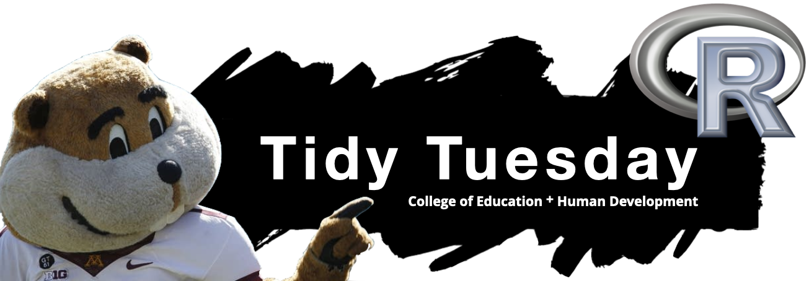

 

 

Welcome to the CEHD Tidy Tuesday graduate student meetup page! Inspired by the [Tidy Tuesday Social Data Project](https://thomasmock.netlify.app/post/tidytuesday-a-weekly-social-data-project-in-r/), the goal of this meetup is to promote participants’ computational skills, especially those for working with data. At the meetup, we work with data from the Tidy Tuesday project to practice and improve our techniques for visualizing and working with raw data, while leveraging the community aspect of the group to learn from each other. 

 

Join us Spring 2022 every Tuesday from 4:00 PM &ndash;5:30 in [Bruininks Hall (Room 123)](https://campusmaps.umn.edu/robert-h-bruininks-hall)!

